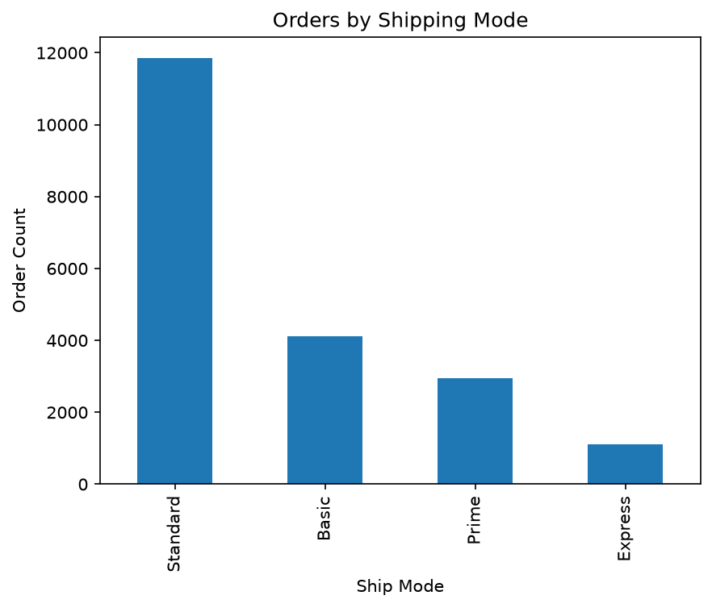
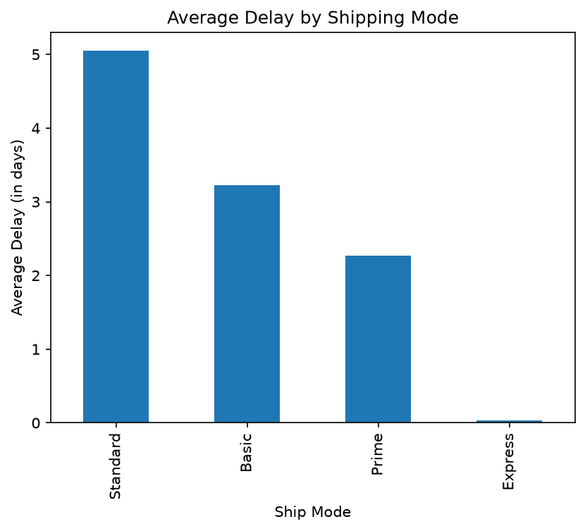
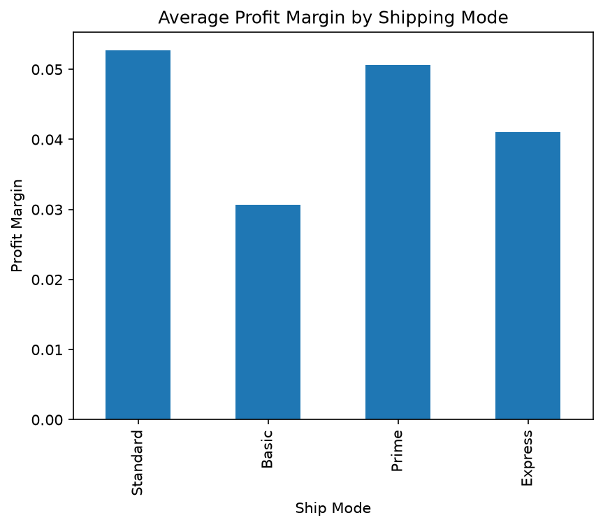
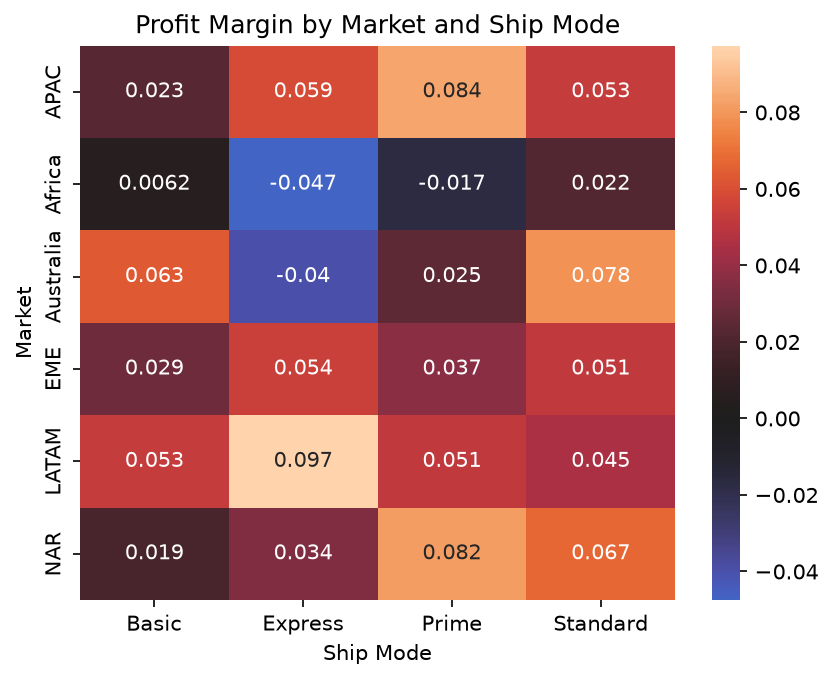
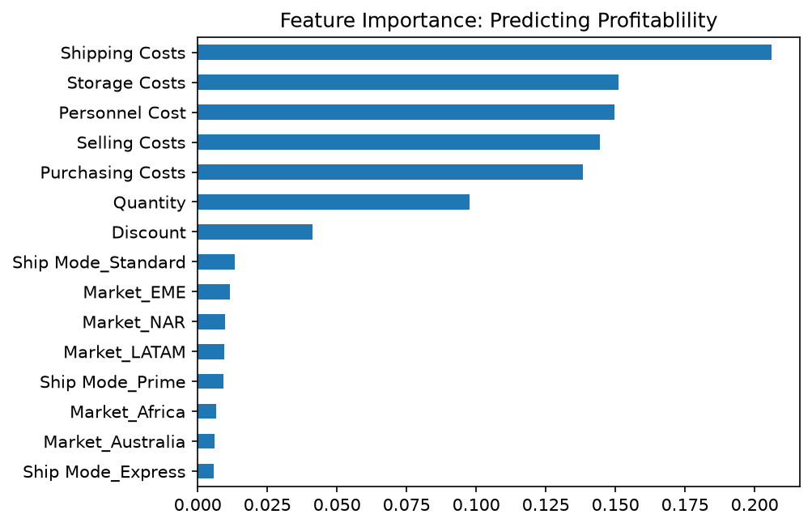

# Logistical-sales-data-analysis

This project is a Python analysis of a global electronics retail dataset from Kaggle. Using Python data libraries to clean, explore, and visualize the sales data then using a machine learning model to predict whether an order is profitable or not.

The dataset has over 20,000 rows and 29 columns that span six major markets. Those markets being:
- APAC (Asia - Pacific)
- Africa
- Australia
- EME (Europe and the Middle East)
- LATAM (Latin America)
- NAR (North America)

The major columns used are:
- Ship Mode
- Order Date
- Ship Date
- Market
- Sales
- Profit
- Discount
- Quantity
- Shipping Costs
- Storage Costs
- Personnel Cost
- Selling Costs
- Purchasing Costs
---

## What was explored

During this analysis I started off cleaning the data since some of the orders had shipping dates that happened before their order dates.

After cleaning I started figuring out which shipping mode is used the most, and whether it is actually the fastest.

This led into a follow up in if the fastest shipping mode costs more or has a lower margin. 

Checking for margins and cost by mode led to checking if the pattern that was found was holding across all six of the markets. It held in all markets except Africa and Australia.

This caused a deeper look into what's causing these two markets to go negative.

Finally, a machine learning model was built and used to test whether those driving factors could be recovered independently instead of relying on the manual breakdown.

---

## Key findings

### Most used shipping mode, fastest shipping mode
The first key finding was after the data cleaning. It was found that the Standard shipping mode is the most used, followed by Basic, Prime and then Express at last. While it was used the least, Express was the fastest shipping mode, while Standard was the most used and the slowest. This was expected.

This chart shows the number of orders by shipping mode, showing Standard being the most used, Express being the least used:

While this following chart shows the Average delay by shipping mode, Express having the smallest average delay while Standard has the biggest average delay:

### Express is not expensive to offer, cost savings of the shipping modes
After this, I checked whether Express is expensive to offer, and if the slowness of standard translates into any cost savings. What was found was that the shipping cost is basically the same across all four of the shipping modes. There is only really a $11 difference between the cheapest option, which is Express at about $148.50, and Basic which is the most expensive at about $159.03.

This is where the profit Margin comes in, I found that the Standard shipping mode has the highest profit margin, while the Basic shipping mode has the lowest margin:

### Discount has a small range for the shipping modes
Following this find, I checked if Discount has something to do with the difference in margin. It turns out that that is not the case as Discount has too small of a range by the shipping modes, so it wasn't the reason.

### Basic orders carry the highest average costs
This is where I checked the five cost columns. It was found that Basic orders carry the highest average costs across every cost category. While Prime carries the lowest. This matches their margin rankings, along with Discounts and shipping cost not playing a big role as their range is basically flat across all the shipping modes.

### Shipping pattern holds across all markets except Africa and Australia
Once I found this out I decided to check if this shipping mode pattern holds across the different markets. I looked at the Shipping mode usage by market and then the delay by shipping mode in these markets. Both patterns held consistently across markets until I decided to check profit margin by shipping mode, which is where I saw that Africa and Australia are going negative in some areas, more specifically in the Express and Prime shipping modes:

### Why are Africa and Australia negative?

After comparing the cost structure with a bunch of different factors:
- Global Express mode
- Global Prime mode
- Africa Express mode
- Africa Prime mode
- Australia Express mode

It turns out that the cost of express shipping in Australia is higher everywhere compared to the global express baseline. On top of all of that the discount is lower there so that means the reason why it's negative is just because everything costs more there. This is probably because of their geographic location and how isolated and far away Australia is.

In the case of Africa however, The cost columns are lower than the global baseline for both Express shipping and Prime shipping. This means that it isn't expensive to ship stuff to Africa. The discount in Africa for both negative shipping modes is also higher than the global baseline. So if Africa is getting less sales, that would make the most sense along with the higher discount rates, which is most likely what is causing it to go negative.

The Average sales for Africa are below the global baseline for Express, while Australia's is slightly higher than the global baseline. This means that Australia loses money because of the high costs of shipping things there, while Africa loses money because the order values are much smaller so the costs consume a disproportionate share of the revenue.

---

## Predicting with machine learning

### Predicting order profitability with a Random Forest model

After going through the data myself, I used a Random Forest model to test whether an order's profitability could be predicted from it's features, and whether the model would independently pick up on the same patterns that I found, specifically the Australia and Africa case.

The target variable was whether an order was profitable or not, based on whether Profit was greater than zero. Before training anything, I checked the class balance, about 74% of orders were profitable, and 26% weren't This meant a model that just guessed "profitable" every time would already be right 74% of the time, so that became the baseline the model needed to beat.

For features, I used:
- Ship Mode
- Market
- Discount
- Quantity
- Shipping Costs
- Storage Costs
- Personnel Cost
- Selling Costs
- Purchasing Costs

Sales was deliberately left out, since it's too close to Profit, including it would have inflated the model's accuracy without teaching anything meaningful about what actually drives profitability.

The model reached 82% accuracy, meaningfully it got above the 74% baseline. Looking at feature importance, the cost columns dominated, while Discount and the Africa and Australia market indicators ranked near the bottom:

Since Africa and Australia were the clearest finding from the data breakdown I did, the model didn't flag them as important on its own. It's probably because an aggregate model trained across all markets and modes at once can smooth over effects that only show up when a specific subgroup is isolated. My breakdown and the model were answering slightly different questions, one looked for patterns within specific slices of the data, the other looked for patterns that hold on averages across all of it.

---

## Tools used:

- Numpy: Numerical operations
- Openpyxl: Reading the dataset from its original excel format
- Pandas: Cleaning, filtering, aggregating the data
- Matplotlib and Seaborn: Data Visualization
- Scikit learn: Random Forest machine learning model
- Jupyter Notebook: Environment for cleaning, exploring, visualizing, and machine learning
